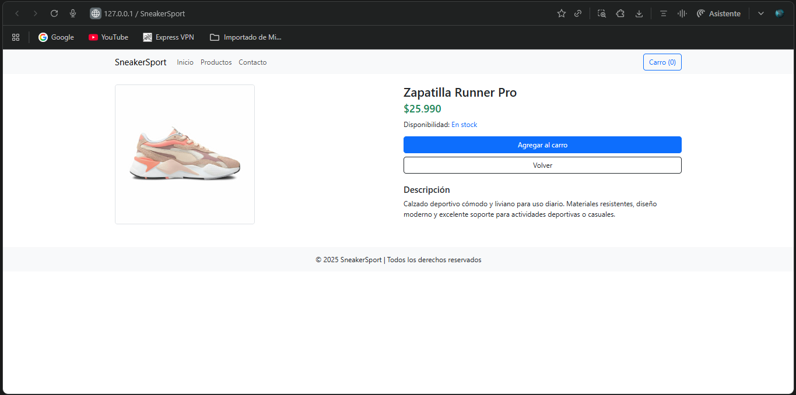

# M2 — E-commerce Frontend

## Descripción
Este proyecto consiste en la interfaz web de una tienda e-commerce. Incluye navegación principal, listado de productos en tarjetas, página de detalle de producto y footer con información básica.

## Nota
Los textos en verde dentro del código HTML corresponden a **comentarios** que sirven solo como guía para mi organización y entendimiento del proyecto.

## Tecnologías
- HTML5
- CSS3
- Bootstrap 5 por CDN

## Ejecutar el proyecto
- Opción 1: Abrir el archivo `index.html` en el navegador.
- Opción 2: Usar Live Server en Visual Studio Code.

## Funcionalidades
- Barra de navegación para moverse por el sitio.
- Listado de productos en tarjetas con botón de compra.
- Página de detalle de producto con imagen, precio y descripción.
- Footer con información de la tienda.

## Capturas

## Autor
Patricio Valenzuela — [Perfil de GitHub](https://github.com/PATRICIORVH)