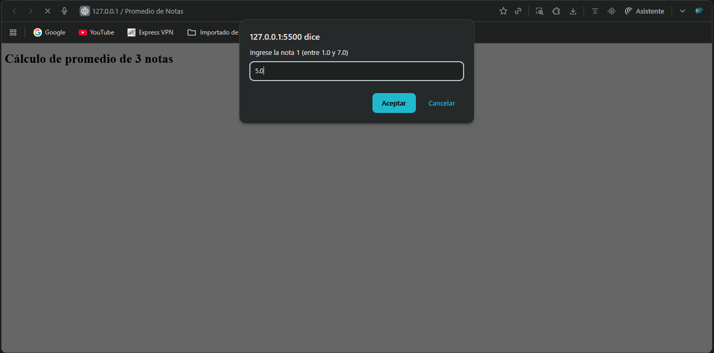
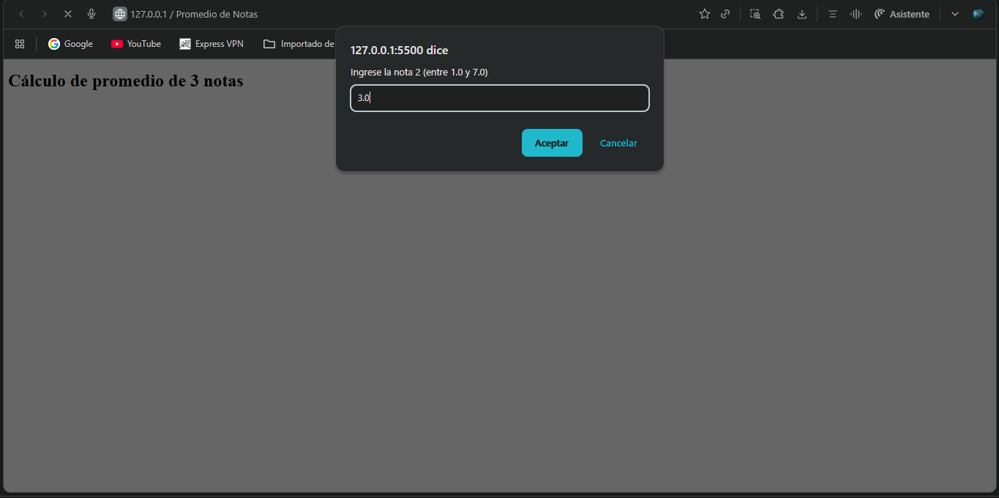
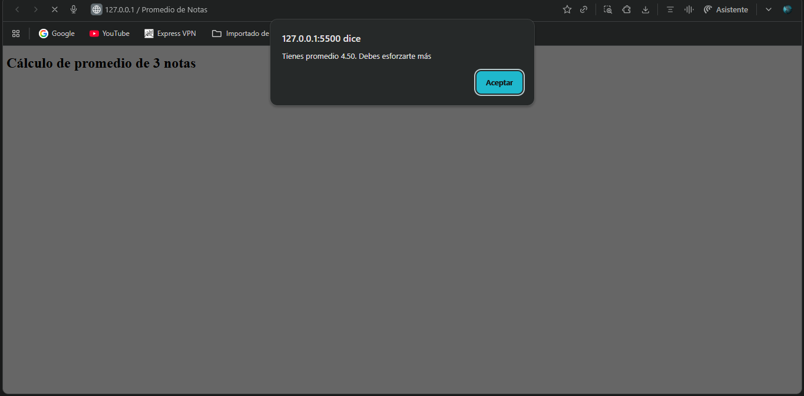
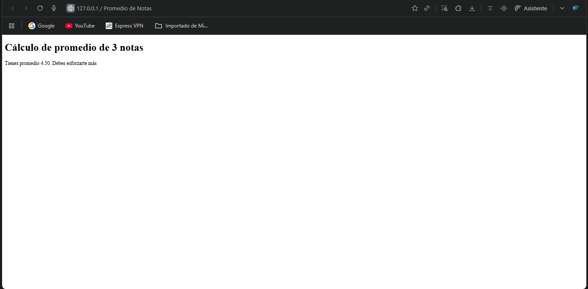

# Ejercicio 02 - Promedio de notas

En este ejercicio el programa pide 3 notas al usuario usando `prompt()`. Luego convierte esas notas a números con `parseFloat()` y calcula el promedio.

Según el promedio, el programa muestra un mensaje diferente usando `if`, `else if` y `else`. Las notas deben estar entre 1.0 y 7.0; si el usuario escribe algo incorrecto, se le vuelve a pedir la nota.

El resultado final se muestra en la página con `document.write()`, en una ventana con `window.alert()` y también en la consola con `console.log()`.

## Capturas de pantalla

